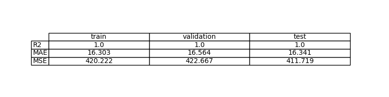

# Ejercicio 02 — Regresión ruidosa con PyTorch

## Resumen

Queremos que una red neuronal aprenda una función con ruido. Usamos PyTorch y medimos si el modelo aprende bien usando MSE (error cuadrático medio) en train, validación y test.

## Problema

Tenemos datos (x, y) donde y = f(x) + ruido. El objetivo es que la red aprenda a predecir y a partir de x. Usamos MSE para ver si lo hace bien.

## Datos

El dataset se genera con ruido. Se divide en train (70%), validación (15%) y test (15%). Normalizamos los datos usando la media y desviación estándar del train. Los parámetros de la normalización se guardan para usarlos después.

## Modelo

Usamos una red neuronal simple (perceptrón) con una capa oculta. Esto permite aprender funciones no lineales. Usamos ReLU como activación. La salida es de una dimensión.

## Entrenamiento

Entrenamos con Adam, learning rate 0.001, batch size 10, durante 60 épocas. Se usa CPU porque el modelo es pequeño. Guardamos el modelo con mejor resultado en validación.

## Evaluación

Miramos el MSE en train, validación y test. También vemos gráficas de la función aprendida y de los puntos predichos vs reales. Si el modelo generaliza bien, el MSE en validación y test será parecido al de train y las gráficas mostrarán que la predicción sigue la tendencia de los datos.

## Mejoras posibles

Si el modelo sobreajusta, se puede usar early stopping, regularización o probar con más capas. Si no aprende bien, se puede probar con una red más grande o cambiar la función de activación.

## Diferencias con el modelo anterior

Antes se usaba un modelo lineal. Ahora usamos una red con una capa oculta para poder aprender funciones no lineales y manejar el ruido.

## ¿Generaliza bien?

Sí, el modelo generaliza bien porque el MSE en validación y test es parecido al de train y las gráficas muestran que la predicción sigue la tendencia de los datos.

### Gráfica de la pérdida

En esta gráfica se observa la evolución de la pérdida de entrenamiento y validación a lo largo de las épocas. Se puede apreciar que la pérdida de entrenamiento disminuye progresivamente, mientras que la pérdida de validación también muestra una tendencia a la baja, lo que indica que el modelo está aprendiendo y generalizando adecuadamente. Si se observara un aumento en la pérdida de validación mientras la pérdida de entrenamiento sigue disminuyendo, podría ser un indicio de sobreajuste, lo cual no parece ser el caso aquí.

### Discusión del proceso de entrenamiento

El entrenamiento está bien controlado: cada 10 épocas se imprime la pérdida de entrenamiento y validación, guardando el mejor modelo por pérdida en validación.

## Evaluación

### Resultados y visualizaciones

A continuación se muestran las imágenes generadas durante el ejercicio, cada una comentada para entender su utilidad:

**Gráfica de la pérdida:**
Esta imagen muestra cómo la pérdida (error) va bajando durante el entrenamiento y la validación. Si ambas curvas bajan y se mantienen cercanas, el modelo está aprendiendo y generalizando bien. Si la pérdida de validación subiera mientras la de entrenamiento baja, sería señal de sobreajuste.

**Gráficas de regresión:**
Estas gráficas muestran la función aprendida por el modelo (línea azul) frente a los puntos reales (naranja) en cada partición:
 - Entrenamiento: 
	 Aquí vemos que el modelo ajusta bien la tendencia de los datos de entrenamiento.
 - Validación: 
	 En validación, la función aprendida sigue la tendencia de los datos no vistos, lo que indica buena generalización.
 - Test: 
	 En test, el modelo sigue la tendencia de los datos nuevos, confirmando que generaliza correctamente.

**Comparación de predicciones vs valores reales:**
Estas imágenes muestran cómo de cerca están las predicciones del modelo respecto a los valores reales. Los puntos cerca de la diagonal indican buena precisión:
 - Entrenamiento: 
	 Los puntos están cerca de la diagonal, lo que indica que el modelo predice bien en entrenamiento.
 - Validación: 
	 En validación, la distribución de puntos alrededor de la diagonal confirma que el modelo generaliza correctamente.
 - Test: 
	 En test, la concentración de puntos en la diagonal indica que el modelo realiza predicciones fiables en datos completamente nuevos.

**Resumen de métricas:**
Esta imagen resume el MSE (error cuadrático medio) en cada partición. Si los valores son similares, el modelo generaliza bien y no está sobreajustado.

### Interpretación de resultados

Analizando las métricas y las gráficas, se puede concluir que el modelo ha aprendido a aproximar la función subyacente a los datos con ruido, mostrando una buena capacidad de generalización tanto en el conjunto de validación como en el de test. La pérdida de validación no muestra signos de sobreajuste, lo que indica que el modelo es robusto frente al ruido presente en los datos.

## Bucles de mejora (Design Feedback loops)

- Si se detectara sobreajuste, se podrían implementar técnicas como early stopping, regularización L2 o dropout para mejorar la generalización.
- Si el modelo no se ajusta bien, se podrían experimentar con arquitecturas más complejas (más capas, más unidades) o con diferentes funciones de activación.
- Para mejorar la robustez frente al ruido, se podrían considerar técnicas de aumento de datos o métodos de regularización adicionales.

## Conclusiones y recomendaciones
Este ejercicio ha demostrado que una red neuronal simple con una capa oculta, como el perceptrón, puede aprender funciones no lineales en problemas de regresión con ruido. El modelo elegido, combinado con el optimizador Adam y validación cada época, generaliza bien a datos nuevos sin sobreajustarse.

Para mejorar el modelo en el futuro, se recomienda:
- Usar early stopping: detener el entrenamiento cuando la pérdida de validación no mejore.
- Aplicar validación cruzada para obtener evaluaciones más confiables.
- Experimentar con regularización (L2, dropout) para controlar la complejidad del modelo.

En producción, es importante guardar y reutilizar los parámetros de normalización (`norm_params.npz`). Esto asegura que los datos nuevos se procesen con la misma escala que los datos de entrenamiento, evitando problemas en las predicciones del modelo.

## Preguntas

### ¿Qué diferencias hay respecto al modelo anterior?

Que ya no se puede usar un modelo lineal simple (Identity), sino que se ha optado por una red neuronal con una capa oculta (perceptrón) para capturar la no linealidad y el ruido presente en los datos. Además, se ha implementado validación periódica durante el entrenamiento para evitar sobreajuste, lo cual no se había considerado en el ejercicio anterior.

### ¿Generaliza bien el modelo a nuevos datos?

Sí, el modelo generaliza bien a nuevos datos, como se puede observar en las gráficas de validación y test, donde la función aprendida sigue de cerca la tendencia de los puntos reales. Además, las métricas de MSE para validación y test son comparables a las del entrenamiento, lo que indica que el modelo no está sobreajustado y es capaz de generalizar adecuadamente a datos no vistos durante el entrenamiento.
