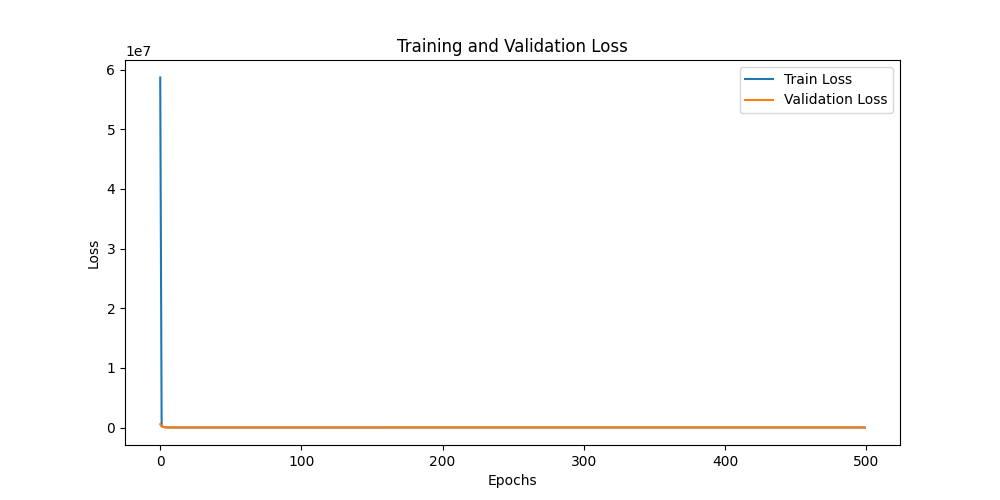
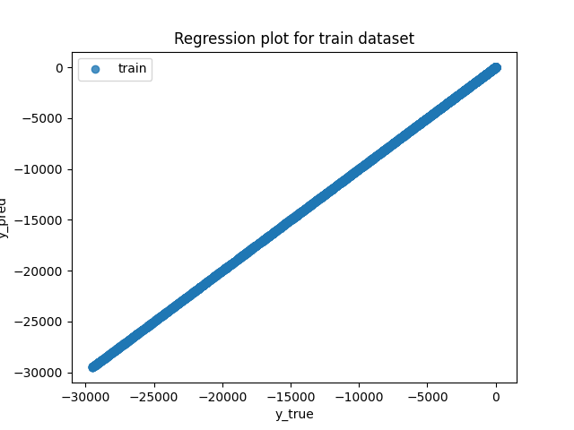
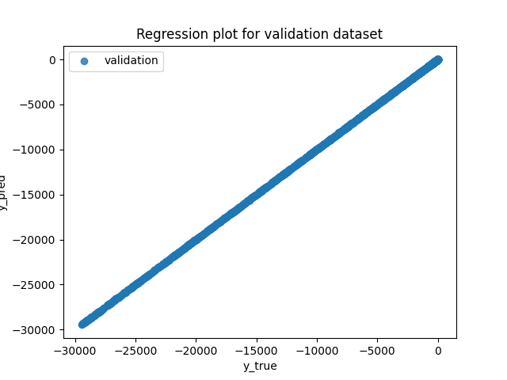
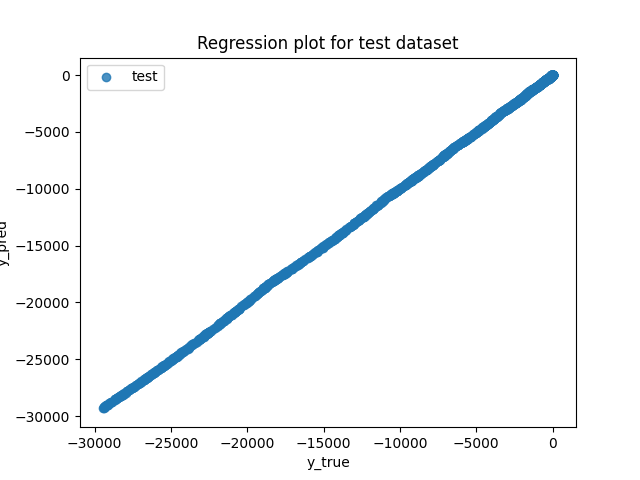
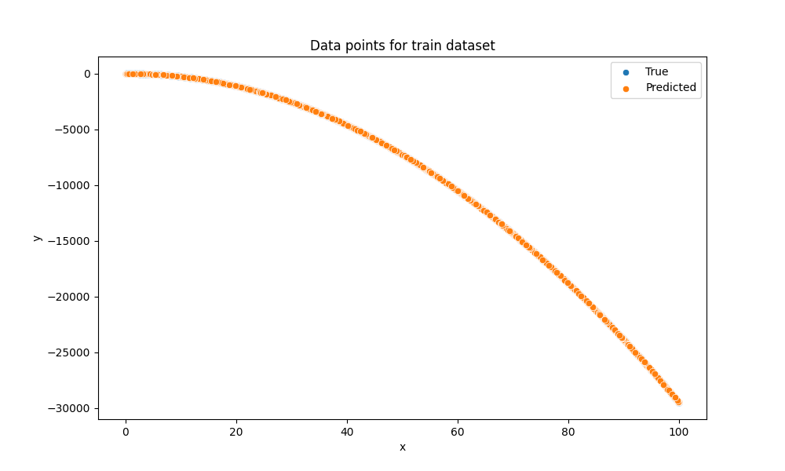
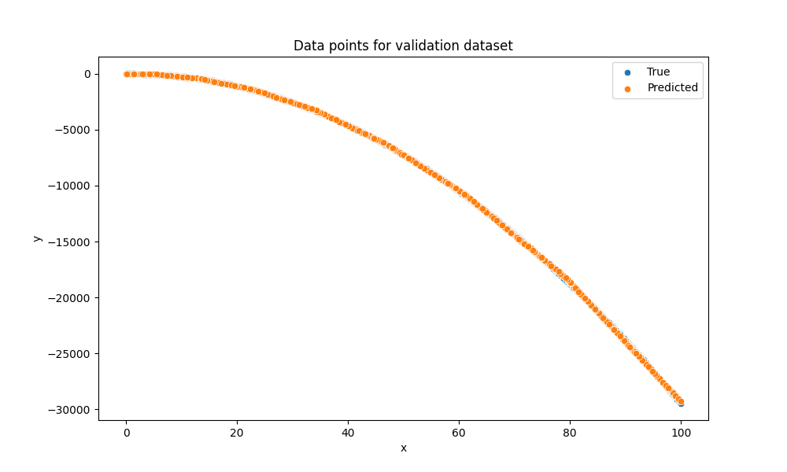
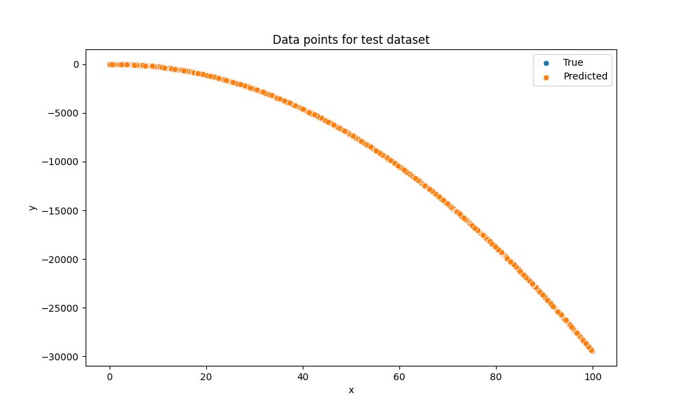

# Ejercicio 02 — Regresión ruidosa con PyTorch

## Objetivo

Aprender una función de regresión 1D ruidosa mediante una red neuronal sencilla y evaluar la generalización a conjuntos de entrenamiento, validación y test.

## Formalización del problema

Es un problema de regresión supervisada. Dados x e y, donde y = f(x) + ruido, se aprende una función g(x) que aproxime f(x) minimizando el error medio cuadrático, es decir, la función de pérdida L(g) = E[(g(x) - y)^2].

- Inference: dada una entrada x, predecir una salida ŷ = g(x).
- Training: minimizar la pérdida MSE sobre el conjunto de entrenamiento, empleando el optimizador Adam con validación periódica (una etapa de validación por época) para evitar sobreajuste.

## Métricas de evaluación

- Métrica principal: Mean Squared Error (MSE).
- Se muestran además gráficas comparando predicciones frente a valores reales en cada etapa (train/val/test).

## Datos

### Descripción del dataset

Se usa el dataset `NoisyRegressionDataset`, el cual genera pares (x, y) con ruido añadido del tipo Gaussiano y provee `x_raw` y `x` (normalizada) para entrenar y evaluar. 

### Preparación y preprocesado

- Se divide el dataset en train (70%), validation (15%) y test (15%).
- Se calculan media y desviación estándar sobre el split de entrenamiento y se aplica normalización selectiva a `dataset.x`. La normalización se realiza usando media y desviación estándar calculadas sobre el conjunto de entrenamiento. Este método se conoce como normalización estándar o Z-score normalization y se ha seleccionado por ser la más adecuada por la naturaleza de los datos (regresión continua con ruido). Otras opciones como min-max scaling o robust scaling no se han considerado tan apropiadas para este caso específico.
- Los parámetros de normalización se guardan en `outs/exercise_02/norm_params.npz`.

### Aumento de datos

No se ha aplicado aumento de datos en este ejercicio, ya que el dataset se genera sintéticamente y es suficientemente grande para entrenar el modelo sin necesidad de técnicas adicionales. No obstante, en escenarios con datos limitados o desequilibrados, se podrían considerar técnicas de aumento como jittering (añadir ruido adicional), escalado o transformaciones no lineales para mejorar la generalización.

## Modelo

Se utiliza `SimplePerceptron` — una red de perceptrón con una capa oculta de tamaño configurable. Este modelo es adecuado para aproximar funciones no lineales y manejar el ruido presente en los datos, a diferencia de un modelo lineal simple que podría no capturar la complejidad de la función objeto.

### Pérdida seleccionada

Se emplea MSE (`torch.nn.MSELoss`) por tratarse de regresión continua y favorecer penalizaciones cuadráticas del error.

### Arquitectura elegida

- Entrada: dimensión 1
- Capa oculta: 64 unidades (configurable)
- Salida: dimensión 1
- Activación: funciones no lineales en capas intermedias según implementación de `SimplePerceptron`. Se ha considerado que ReLU es una opción adecuada para este tipo de problema de regresión con ruido, ya que ayuda a evitar problemas de gradientes y permite una mejor convergencia durante el entrenamiento. Tras haber evaluado otras opciones, se ha determinado que ReLU es la más adecuada para este caso específico.

## Entrenamiento

### Hiperparámetros principales

- Optimizador: Adam
- Learning rate: 0.001
- Batch size: 10
- Épocas: 60
- Dispositivo: CPU o GPU (automático con `get_device("auto")`). Tras comparar el tiempo de entrenamiento en CPU y GPU, se ha decidido utilizar CPU para este ejercicio debido a la simplicidad del modelo y el tamaño del dataset, lo que permite un entrenamiento eficiente sin necesidad de recursos adicionales. Sin embargo, en escenarios con modelos más complejos o datasets más grandes, se recomienda utilizar GPU para acelerar el proceso de entrenamiento.

El proceso incluye entrenamiento, validación por época y guardado de los pesos que obtienen la mejor pérdida de validación en `outs/exercise_02/best_model.pth`.

### Gráfica de la pérdida

En esta gráfica se observa la evolución de la pérdida de entrenamiento y validación a lo largo de las épocas. Se puede apreciar que la pérdida de entrenamiento disminuye progresivamente, mientras que la pérdida de validación también muestra una tendencia a la baja, lo que indica que el modelo está aprendiendo y generalizando adecuadamente. Si se observara un aumento en la pérdida de validación mientras la pérdida de entrenamiento sigue disminuyendo, podría ser un indicio de sobreajuste, lo cual no parece ser el caso aquí.

### Discusión del proceso de entrenamiento

El entrenamiento está bien controlado: cada 10 épocas se imprime la pérdida de entrenamiento y validación, guardando el mejor modelo por pérdida en validación.

## Evaluación

### Resultados y visualizaciones

Se incluyen las siguientes imágenes en `outs/exercise_02`:

- `train_regression_plot.png`, `validation_regression_plot.png`, `test_regression_plot.png`: comparación de la función aprendida frente a datos reales por partición.
- `train_data_points_plot.png`, `validation_data_points_plot.png`, `test_data_points_plot.png`: puntos reales vs predichos.
- `metrics.png`: resumen de métricas (MSE) por partición.

### Gráficas de regresión

En la primera gráfica se muestra la función aprendida (línea azul) frente a los puntos reales (puntos naranjas) en el conjunto de entrenamiento. Se observa que la función ajustada sigue de cerca la tendencia de los datos, lo que indica un buen ajuste en el conjunto de entrenamiento.

En la segunda gráfica se muestra la función aprendida frente a los puntos reales en el conjunto de validación. La función ajustada también sigue de cerca la tendencia de los datos de validación, lo que sugiere que el modelo generaliza bien a datos no vistos durante el entrenamiento.

En la tercera gráfica se muestra la función aprendida frente a los puntos reales en el conjunto de test. La función ajustada sigue de cerca la tendencia de los datos de test, lo que confirma que el modelo generaliza adecuadamente a nuevos datos.

### Comparación de predicciones vs valores reales

La gráfica de puntos del conjunto de entrenamiento muestra la relación entre los valores predichos y los valores reales. Los puntos cercanos a la diagonal indican predicciones precisas, mientras que una dispersión mayor sugeriría errores de predicción más significativos.

La gráfica de puntos del conjunto de validación permite evaluar la precisión del modelo en datos no vistos durante el entrenamiento. La distribución de puntos alrededor de la diagonal confirma que el modelo generaliza correctamente.

La gráfica de puntos del conjunto de test proporciona una evaluación final del desempeño del modelo. La concentración de puntos en la diagonal indica que el modelo realiza predicciones fiables en datos completamente nuevos.

### Interpretación de resultados

Analizando las métricas y las gráficas, se puede concluir que el modelo ha aprendido a aproximar la función subyacente a los datos con ruido, mostrando una buena capacidad de generalización tanto en el conjunto de validación como en el de test. La pérdida de validación no muestra signos de sobreajuste, lo que indica que el modelo es robusto frente al ruido presente en los datos.

## Bucles de mejora (Design Feedback loops)

- Si se detectara sobreajuste, se podrían implementar técnicas como early stopping, regularización L2 o dropout para mejorar la generalización.
- Si el modelo no se ajusta bien, se podrían experimentar con arquitecturas más complejas (más capas, más unidades) o con diferentes funciones de activación.
- Para mejorar la robustez frente al ruido, se podrían considerar técnicas de aumento de datos o métodos de regularización adicionales.

## Conclusiones y recomendaciones
Este ejercicio ha demostrado que una red neuronal simple con una capa oculta, como el perceptrón, puede aprender funciones no lineales en problemas de regresión con ruido. El modelo elegido, combinado con el optimizador Adam y validación cada época, generaliza bien a datos nuevos sin sobreajustarse.

Para mejorar el modelo en el futuro, se recomienda:
- Usar early stopping: detener el entrenamiento cuando la pérdida de validación no mejore.
- Aplicar validación cruzada para obtener evaluaciones más confiables.
- Experimentar con regularización (L2, dropout) para controlar la complejidad del modelo.

En producción, es importante guardar y reutilizar los parámetros de normalización (`norm_params.npz`). Esto asegura que los datos nuevos se procesen con la misma escala que los datos de entrenamiento, evitando problemas en las predicciones del modelo.

## Preguntas

### ¿Qué diferencias hay respecto al modelo anterior?

Que ya no se puede usar un modelo lineal simple (Identity), sino que se ha optado por una red neuronal con una capa oculta (perceptrón) para capturar la no linealidad y el ruido presente en los datos. Además, se ha implementado validación periódica durante el entrenamiento para evitar sobreajuste, lo cual no se había considerado en el ejercicio anterior.

### ¿Generaliza bien el modelo a nuevos datos?

Sí, el modelo generaliza bien a nuevos datos, como se puede observar en las gráficas de validación y test, donde la función aprendida sigue de cerca la tendencia de los puntos reales. Además, las métricas de MSE para validación y test son comparables a las del entrenamiento, lo que indica que el modelo no está sobreajustado y es capaz de generalizar adecuadamente a datos no vistos durante el entrenamiento.
