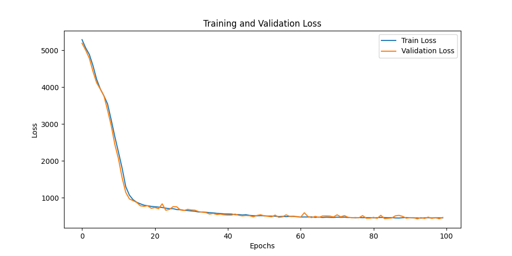
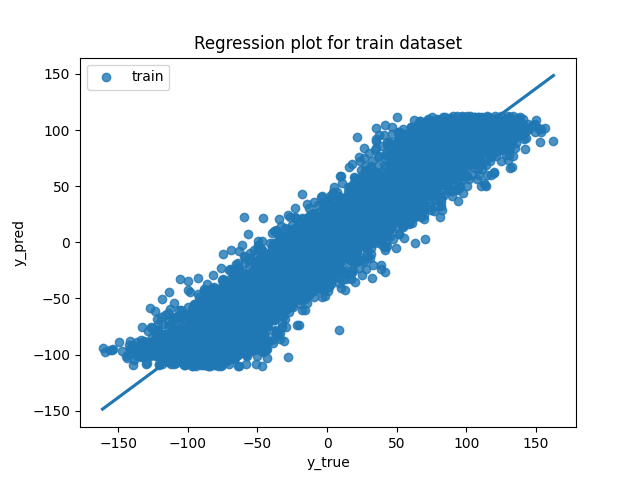
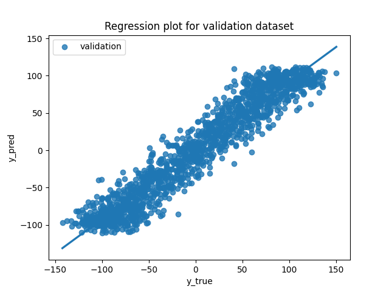
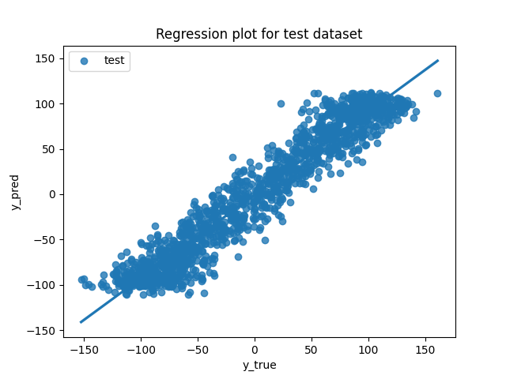
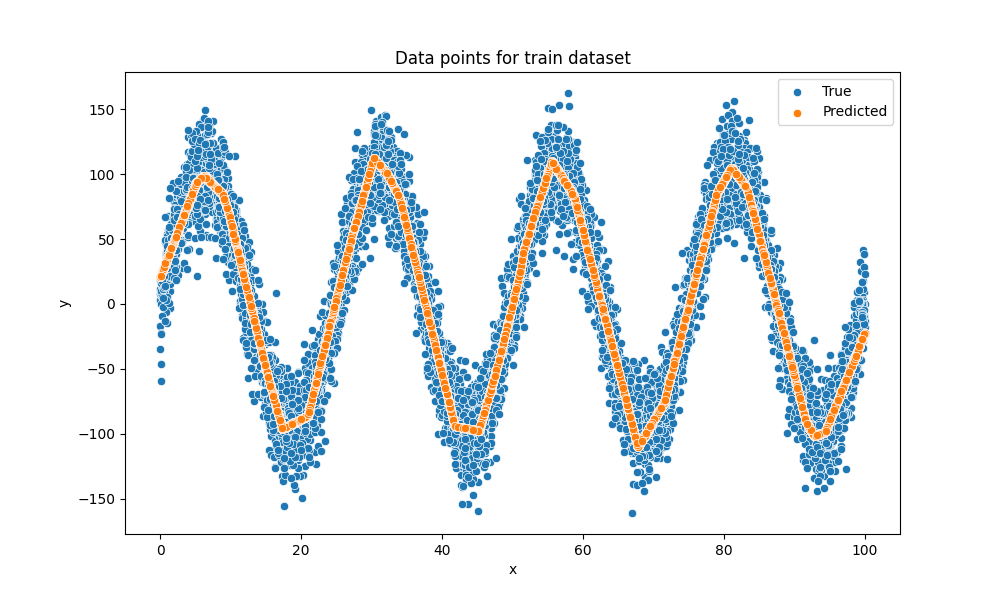
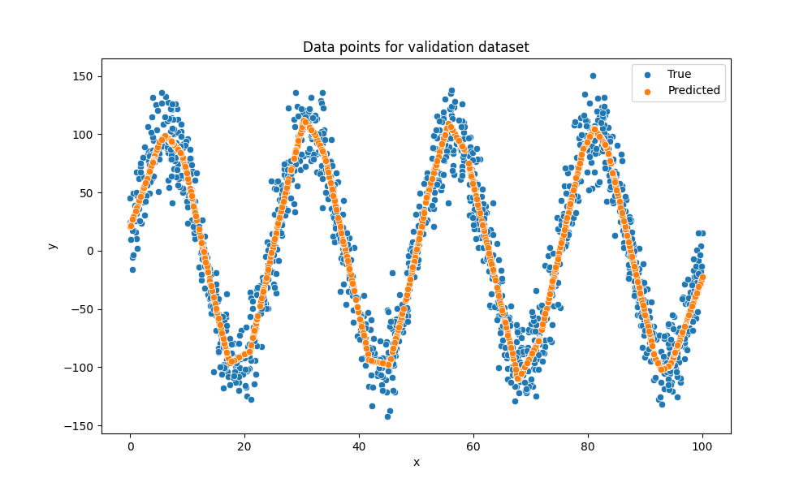
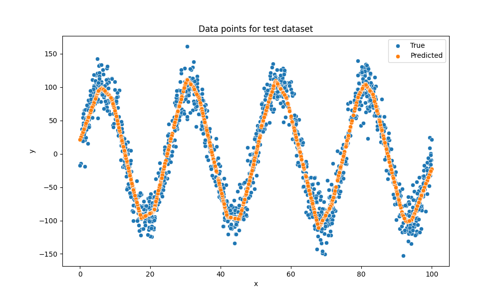
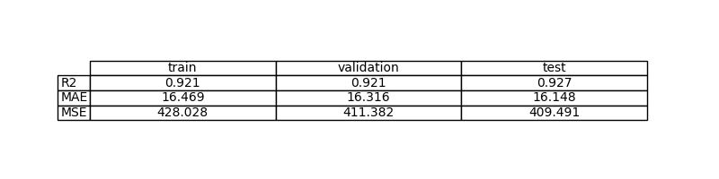

# Ejercicio 03 — Aprender una función sinusoidal con PyTorch

## Resumen

Queremos que una red neuronal aprenda una función seno con ruido. Usamos PyTorch y medimos si el modelo aprende bien usando MSE, MAE y R² en train, validación y test.

## Problema

Tenemos datos (x, y) donde y es una función seno de x más ruido. El objetivo es que la red aprenda a predecir y a partir de x. Usamos MSE como principal métrica.

## Datos

El dataset se genera con x en [0, 100] y y = 100*sin(8πx/100) + 2 + ruido. Se divide en train, validación y test. Normalizamos x usando la media y desviación estándar del train. Los parámetros de la normalización se guardan para usarlos después. No se normaliza y.

## Modelo

Usamos una red neuronal (MLP) con varias capas ocultas (por ejemplo, 3 capas de 16 neuronas). La salida es de una dimensión y no tiene activación. Usamos MSE como función de pérdida porque es lo que queremos minimizar.

## Entrenamiento

Entrenamos con Adam, learning rate 0.001, batch size 10, durante 100 épocas. Guardamos el modelo con mejor resultado en validación. Si la pérdida no baja, revisamos la normalización, el learning rate o la arquitectura.

## Evaluación

Miramos el MSE, MAE y R² en train, validación y test. También vemos gráficas de la función aprendida y de los puntos predichos vs reales. Si el modelo generaliza bien, el MSE en validación y test será parecido al de train y las gráficas mostrarán que la predicción sigue la tendencia de los datos, aunque no acierte los picos exactos por el ruido.

## Mejoras posibles

Si el modelo sobreajusta, se puede usar regularización (weight decay, Dropout) o reducir la capacidad. Si no aprende bien, se puede probar con una red más grande, más épocas o revisar la normalización.

## Diferencias con el modelo anterior

Este modelo tiene más capas y más neuronas que el anterior, así puede aprender funciones más complejas como el seno. También normalizamos solo usando el train y guardamos los parámetros para usarlos después.

## ¿Generaliza bien?

Sí, el modelo generaliza bien si el MSE en test y validación es parecido y bajo. Si el MSE de test es mucho mayor, hay sobreajuste. Si todos los MSE son altos, hay subajuste y hay que mejorar el modelo.

## Resultados y visualizaciones

A continuación se muestran las imágenes generadas durante el ejercicio, cada una comentada para entender su utilidad:

**Gráfica de la pérdida:**
Esta imagen muestra cómo la pérdida (error) va bajando durante el entrenamiento y la validación. Si ambas curvas bajan y se mantienen cercanas, el modelo está aprendiendo y generalizando bien. Si la pérdida de validación subiera mientras la de entrenamiento baja, sería señal de sobreajuste.

**Gráficas de regresión:**
Estas gráficas muestran la función aprendida por el modelo (línea azul) frente a los puntos reales (naranja) en cada partición:
 - Entrenamiento: 
	 Aquí vemos que el modelo ajusta bien la tendencia de los datos de entrenamiento.
 - Validación: 
	 En validación, la función aprendida sigue la tendencia de los datos no vistos, lo que indica buena generalización.
 - Test: 
	 En test, el modelo sigue la tendencia de los datos nuevos, confirmando que generaliza correctamente.

**Comparación de predicciones vs valores reales:**
Estas imágenes muestran cómo de cerca están las predicciones del modelo respecto a los valores reales. Los puntos cerca de la diagonal indican buena precisión:
 - Entrenamiento: 
	 Los puntos están cerca de la diagonal, lo que indica que el modelo predice bien en entrenamiento.
 - Validación: 
	 En validación, la distribución de puntos alrededor de la diagonal confirma que el modelo generaliza correctamente.
 - Test: 
	 En test, la concentración de puntos en la diagonal indica que el modelo realiza predicciones fiables en datos completamente nuevos.

**Resumen de métricas:**
Esta imagen resume el MSE, MAE y R² en cada partición. Si los valores son similares, el modelo generaliza bien y no está sobreajustado.
