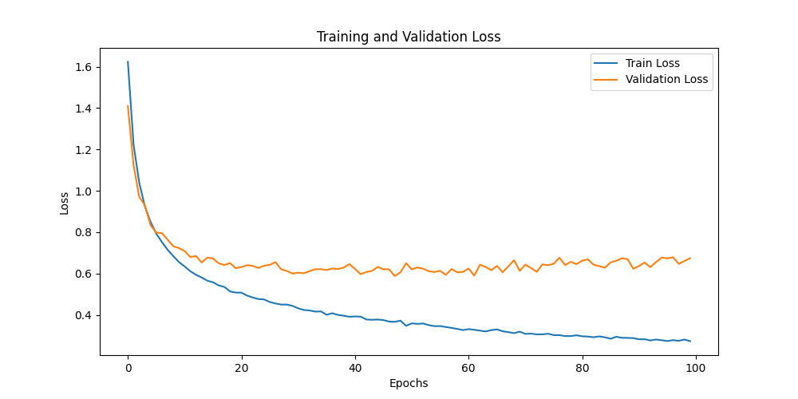
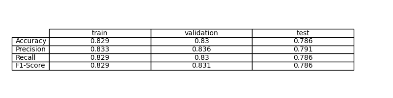
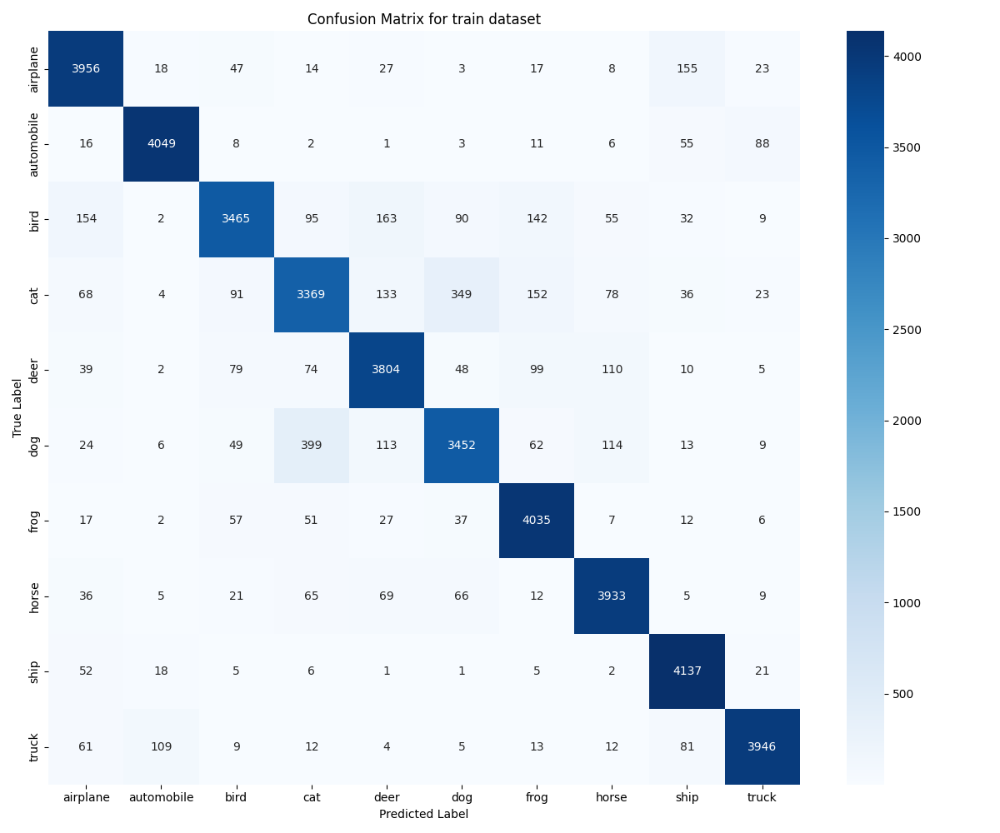
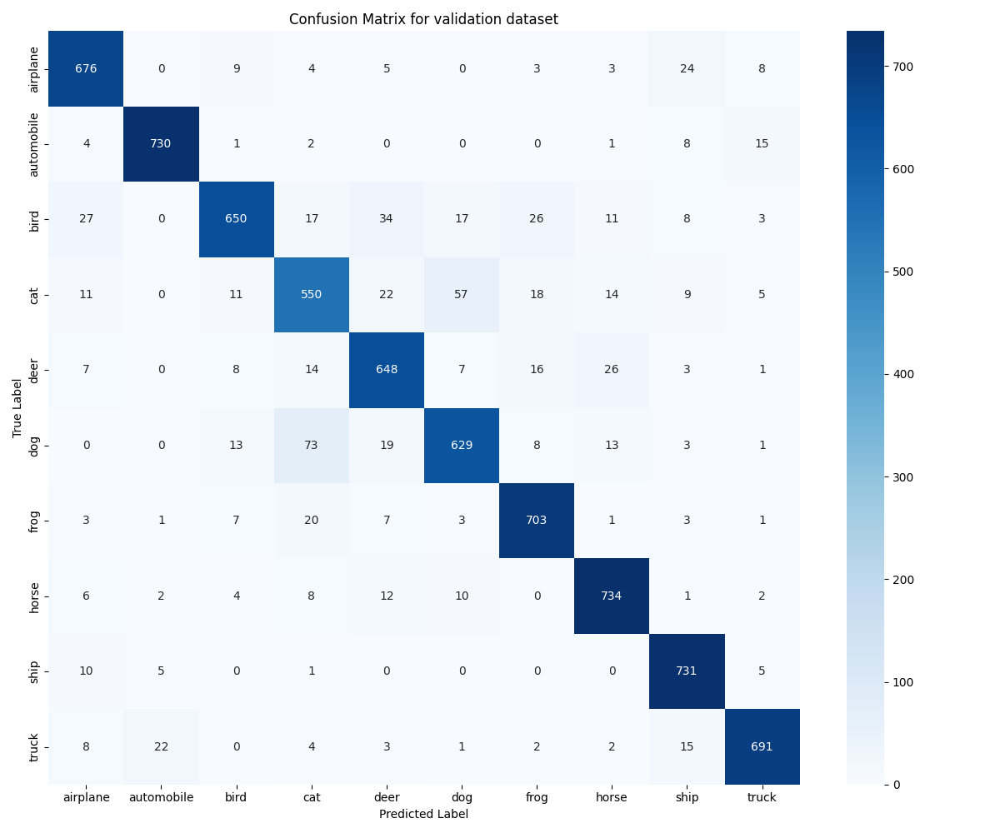

# Ejercicio 4: Clasificación de imágenes con Deep Learning (CIFAR-10)

## Objetivo

El objetivo de este ejercicio es entrenar una red neuronal convolucional sencilla para clasificar imágenes del dataset CIFAR-10. Queremos ver cómo funciona la red, entender sus resultados y comparar con el ejercicio anterior, donde no usábamos una CNN.

## Formalización de la tarea

El reto consiste en que, dada una imagen pequeña (32x32 píxeles, RGB), la red diga a qué clase pertenece entre las 10 posibles de CIFAR-10. Para entrenar, usamos imágenes ya etiquetadas y ajustamos la red para que acierte lo máximo posible, usando CrossEntropyLoss. Guardamos el modelo que mejor funciona en validación.

## Métricas de evaluación

Para saber si la red aprende, miramos la exactitud y otras métricas como precisión, recall y F1-score. Así comprobamos si acierta y si lo hace de forma equilibrada entre clases.

## Consideraciones sobre los datos

El dataset CIFAR-10 tiene imágenes pequeñas y coloridas de 10 tipos de objetos. Usamos la mayoría para entrenar, una parte para validar y el resto para probar el modelo. Así vemos si la red aprende y si es capaz de acertar con imágenes nuevas.

### Función de pérdida

Usamos CrossEntropyLoss porque es la más habitual para este tipo de problemas y nos simplifica el cálculo de probabilidades.

### Arquitectura

Probamos varias ideas, pero al final nos quedamos con una CNN sencilla: tres capas convolucionales y tres densas. Es suficiente para este tamaño de imagen y no se complica demasiado.

La red primero extrae patrones sencillos y luego va combinando para reconocer objetos. Al final, unas capas densas deciden la clase. No usamos activación en la última capa porque la función de pérdida ya se encarga de eso.

### Hiperparámetros

Usamos Adam, batch de 64, 100 épocas y tasa de aprendizaje 0.001. No complicamos mucho la configuración para centrarnos en entender el proceso.

### Resultados
A continuación se muestra la evolución de la función de pérdida durante el entrenamiento y la validación:

**Gráfica de la pérdida:**
Esta gráfica muestra cómo la pérdida de entrenamiento baja de forma constante, pero la de validación deja de mejorar y se mantiene más alta, lo que indica que el modelo empieza a sobreajustar (overfitting) a los datos de entrenamiento. Es decir, aprende muy bien los datos vistos, pero pierde capacidad de generalizar a datos nuevos.

El modelo aprende bien en entrenamiento y validación, aunque baja un poco en test. Las métricas son bastante estables y la red no parece tener problemas graves de sobreajuste.

A continuación se muestran algunas gráficas y resultados visuales:

**Evolución de la función de pérdida y métricas:**
Esta gráfica muestra cómo la pérdida de entrenamiento baja consistentemente, pero la de validación se estabiliza, confirmando el leve overfitting mencionado anteriormente. A pesar de esto, las métricas generales permanecen estables y el modelo sigue generalizando de forma aceptable.

**Matriz de confusión en entrenamiento:**
Aquí se ve cómo el modelo acierta o falla en cada clase durante el entrenamiento. Sirve para detectar si hay clases más difíciles que otras.

**Matriz de confusión en validación:**
Permite ver el comportamiento del modelo en datos que no ha visto durante el entrenamiento, ayudando a detectar posibles problemas de sobreajuste.

**Matriz de confusión en test:**
Esta matriz muestra el rendimiento final del modelo en el conjunto de prueba, que es el que realmente nos interesa para saber si generaliza bien.

Las matrices de confusión muestran que la red acierta más en unas clases que en otras, pero en general el comportamiento es bueno.

### Discusión

La red aprende a reconocer patrones en las imágenes y luego decide la clase. No hemos visto underfitting y el overfitting es leve, ya que la diferencia entre validación y test no es muy grande. El modelo generaliza bastante bien para este tipo de imágenes.

Para mejorar, podríamos probar más transformaciones de datos, activar dropout o usar arquitecturas más complejas. Pero para el objetivo del ejercicio, la red cumple bien y no hemos querido complicar más de la cuenta.

## Preguntas

### Diferencias con el ejercicio anterior

En el ejercicio anterior usamos una red densa (MLP), que no aprovecha la estructura de las imágenes. Aquí, con la CNN, la red aprende mejor los patrones visuales y necesita menos parámetros. Además, hemos usado augmentación de datos para que la red sea más robusta. En resumen, la CNN es más adecuada para imágenes pequeñas como las de CIFAR-10.

### ¿Generaliza bien el modelo?

El modelo generaliza bastante bien para imágenes similares a las del dataset. Si las imágenes fueran muy distintas, seguramente habría que ajustar la red o usar técnicas más avanzadas. Pero para el objetivo del ejercicio, el resultado es satisfactorio y hemos aprendido mucho sobre cómo funcionan las CNN y el proceso de entrenamiento.