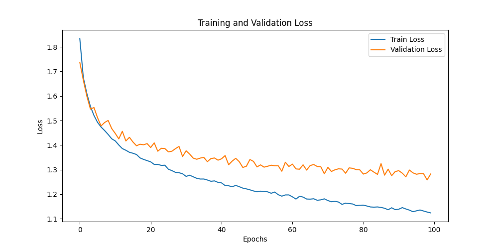
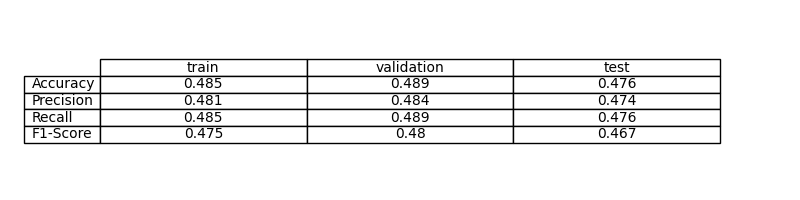
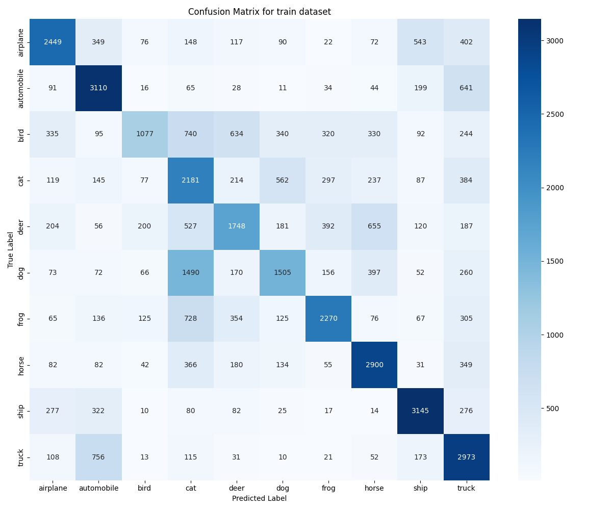
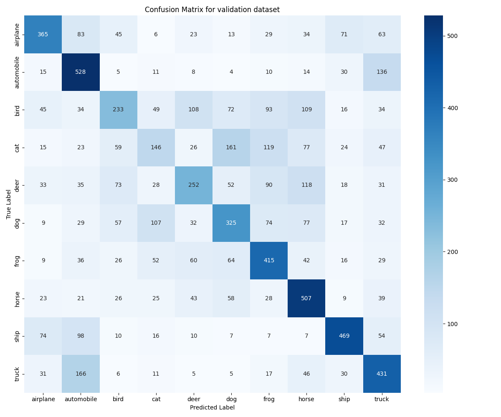
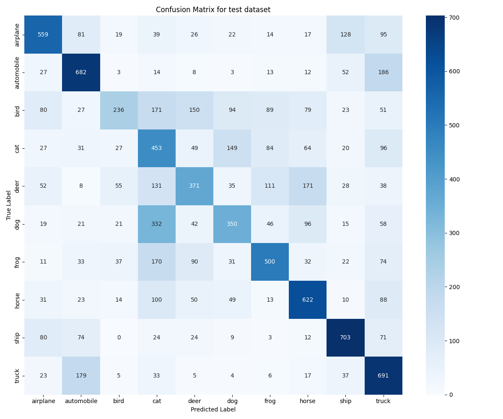

# Ejercicio 5: Modelo de Deep Learning con Red Neuronal Completamente Conectada para CIFAR-10

## Objetivo

En este ejercicio se desarrolla una red neuronal completamente conectada (MLP) para clasificar imágenes del dataset CIFAR-10. El objetivo es ver cómo funciona este tipo de arquitectura y comparar su rendimiento con ejercicios anteriores, especialmente el efecto de la augmentación de datos frente a una CNN.

## Formalización de la Tarea

### Formalización de la Tarea (Inferencia)

El modelo recibe imágenes de 32x32 píxeles en color, las aplana a un vector de 3072 valores y trata de clasificarlas en una de las 10 clases posibles. Al final, predice la probabilidad de cada clase y escoge la más alta.

### Formalización de la Tarea (Entrenamiento)

Entrenamos la MLP con datos etiquetados de CIFAR-10 usando Adam y CrossEntropyLoss. Validamos el modelo con un conjunto aparte y guardamos el mejor resultado según la pérdida de validación.

## Métricas de Evaluación

Para evaluar el modelo usamos la exactitud, precisión, recall y F1-score. Así comprobamos si acierta y si lo hace de forma equilibrada entre clases.

## Consideraciones sobre los Datos

### Descripción del dataset

El dataset CIFAR-10 tiene 60,000 imágenes pequeñas y coloridas de 10 tipos de objetos. Usamos la mayoría para entrenar, una parte para validar y el resto para probar el modelo. Así vemos si la red aprende y si es capaz de acertar con imágenes nuevas.

### Funciones de Pérdida Adecuadas

Para este tipo de problema, la función de pérdida más habitual es CrossEntropyLoss. También existen otras como Focal Loss o Label Smoothing, pero aquí usamos la estándar.

### Función de Pérdida Seleccionada

Usamos CrossEntropyLoss porque es la opción más común para clasificación multiclase en PyTorch.

### Arquitecturas Posibles

Se pueden usar una MLP o una CNN. La MLP es sencilla pero menos eficiente para imágenes y tiene muchos parámetros. La CNN extrae mejor las características espaciales y suele funcionar mejor. Este ejercicio usa una MLP para mostrar sus limitaciones en visión por computadora.

### Arquitectura Seleccionada (MLPClassifier)

**Arquitectura**:

La arquitectura elegida es una MLP con tres capas ocultas (512, 256 y 128 neuronas) y una capa de salida para las 10 clases. Usamos ReLU como activación y dropout está disponible pero no activado. El modelo tiene muchos parámetros, lo que lo hace propenso a problemas de ajuste.

### Activación de la Última Capa

No hay activación en la última capa porque la función de pérdida ya se encarga de eso.

### Otras Consideraciones

La arquitectura completamente conectada ignora la estructura espacial de las imágenes y tiene muchos parámetros, lo que puede llevar a problemas de ajuste. Usamos Adam como optimizador.

### Hiperparámetros de Entrenamiento

Usamos Adam, batch de 64, 100 épocas y tasa de aprendizaje 0.001. No complicamos mucho la configuración para centrarnos en entender el proceso.

### Gráfico de la función de pérdida

La gráfica de la pérdida nos ayuda a ver cómo evoluciona el aprendizaje del modelo. En este caso, tanto la pérdida de entrenamiento como la de validación bajan al principio, pero pronto se estabilizan en valores altos. No hay una diferencia grande entre ambas, lo que nos dice que el modelo no está sobreajustando, sino que está subajustando: no es capaz de aprender bien ni siquiera los datos de entrenamiento. Esto suele pasar cuando usamos una MLP para imágenes, porque se pierden las relaciones espaciales entre píxeles.

### Métricas de Evaluación

Las métricas muestran que el modelo tiene una exactitud de alrededor del 55% en entrenamiento y validación, y baja al 51% en test. La precisión, recall y F1-score siguen valores similares. Esto indica que el modelo no aprende bien y apenas supera la adivinación aleatoria.

### Resultados de la Evaluación

Las matrices de confusión nos permiten ver de forma visual cómo el modelo acierta o falla en cada clase, tanto en entrenamiento, validación como en test. En todas ellas se observa que hay muchos errores y que el modelo no consigue distinguir bien las clases. Esto confirma que la arquitectura MLP no es adecuada para este tipo de datos y que el modelo no generaliza bien.

Entrenamiento:

Validación:

Test:

### Discusión de los Resultados

La MLP trata cada píxel como independiente, por lo que pierde las relaciones espaciales entre ellos. El modelo aprende muy poco y obtiene resultados apenas mejores que la adivinación aleatoria.

Las CNNs capturan mejor estas relaciones espaciales con menos parámetros, por eso funcionan mucho mejor para imágenes. La arquitectura MLP no es adecuada para visión por computadora.

## Preguntas

### ¿Cuáles son las diferencias encontradas entre el modelo anterior (Ejercicio 4) y este (Ejercicio 5)?

En comparación con el ejercicio anterior, donde usamos una CNN, la diferencia es clara. La CNN respeta la estructura espacial de las imágenes, tiene menos parámetros y obtiene resultados mucho mejores. La MLP ignora esa estructura, tiene muchos más parámetros y su rendimiento es muy inferior, incluso usando augmentación de datos.

### ¿Generaliza bien el modelo a nuevos datos?

En cuanto a la generalización, el modelo no generaliza bien. La exactitud en test es baja y apenas supera la adivinación aleatoria. Aunque el gap entre validación y test es pequeño, el rendimiento absoluto es insuficiente. Para imágenes nuevas, el modelo seguiría teniendo resultados pobres y no sería útil en la práctica. Esto muestra por qué las redes convolucionales son tan importantes en visión por computadora: la arquitectura MLP no es adecuada para este tipo de datos y no puede aprender características relevantes.