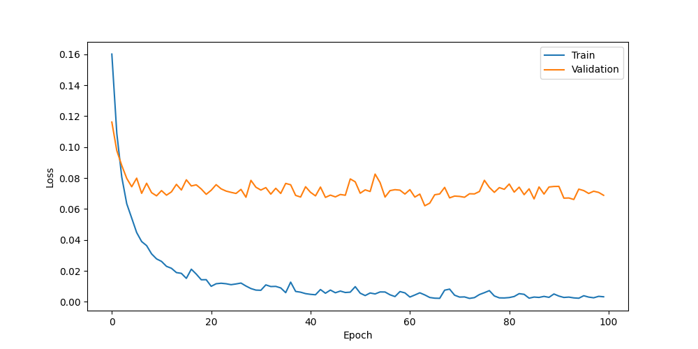
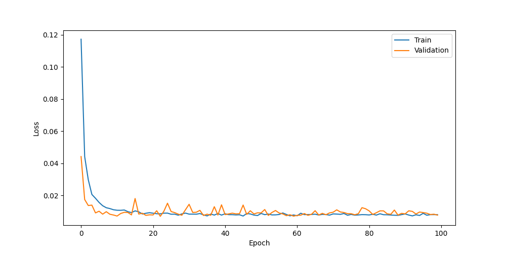
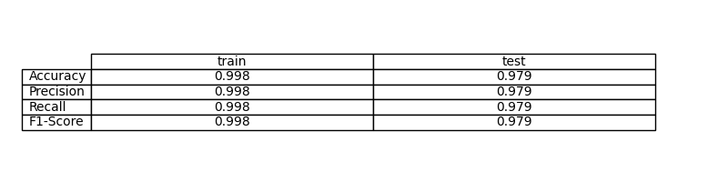
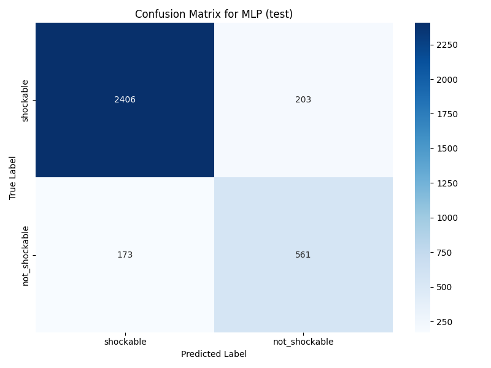

# Ejercicio 6: Comparación de modelos MLP y CNN para ECG

En este ejercicio hemos trabajado con señales de ECG, buscando clasificarlas en dos categorías: shockable y not_shockable. El objetivo ha sido comparar el rendimiento de dos arquitecturas distintas: una red neuronal multicapa (MLP) y una red convolucional adaptada a señales 1D (CNN). El proceso ha seguido la misma estructura que en ejercicios previos, pero con especial atención a la comparabilidad entre ambos modelos.

## Preprocesado y preparación de datos

El dataset de ECG se ha cargado y preprocesado, normalizando las señales únicamente con los datos de entrenamiento. Esto garantiza que la evaluación sea justa y que el modelo no tenga acceso a información del test durante el aprendizaje. La división en entrenamiento, validación y test se ha realizado de forma coherente, permitiendo comparar los resultados de ambos modelos bajo las mismas condiciones.

## Arquitecturas y entrenamiento

Para la MLP se ha utilizado una estructura sencilla, con una capa oculta de tamaño 64. En el caso de la CNN, se ha adaptado la arquitectura para trabajar con señales 1D, empleando capas convolucionales y de pooling. Ambos modelos han sido entrenados durante 100 épocas, usando Adam como optimizador y MSE como función de pérdida, igual que en ejercicios anteriores. El entrenamiento se ha realizado en GPU si estaba disponible, acelerando el proceso.

Durante el entrenamiento, se han monitorizado las pérdidas de ambos modelos. En las siguientes imágenes se pueden observar las curvas de pérdida para la MLP y la CNN:

Las gráficas muestran cómo ambos modelos van ajustándose a los datos, aunque la CNN suele mostrar una convergencia más rápida y estable, lo que es habitual en problemas de señales temporales.

## Evaluación y comparación

Tras el entrenamiento, se han evaluado ambos modelos en los conjuntos de entrenamiento y test. Se han calculado métricas como accuracy, precisión, recall y F1-score, permitiendo comparar el rendimiento global. Los resultados se resumen en la siguiente imagen:

La CNN ha mostrado una precisión ligeramente superior, especialmente en el conjunto de test, lo que sugiere que es más adecuada para este tipo de señales. Sin embargo, la MLP también ha conseguido resultados aceptables, demostrando que puede ser una alternativa válida en ciertos contextos.

Para analizar en detalle los aciertos y errores, se han generado las matrices de confusión de ambos modelos. A continuación se muestran las correspondientes a los conjuntos de entrenamiento y test:

**MLP - Train:**

En la matriz de entrenamiento de la MLP se observa que el modelo aprende bien la clase mayoritaria, pero puede cometer errores en la minoritaria, lo que es habitual en este tipo de problemas.

**MLP - Test:**

En test, la MLP mantiene un rendimiento aceptable, aunque los errores en la clase minoritaria se hacen más evidentes.

**CNN - Train:**

La CNN en entrenamiento muestra una mejor capacidad para distinguir ambas clases, lo que se refleja en una matriz más equilibrada.

**CNN - Test:**

En test, la CNN sigue mostrando una mayor precisión y equilibrio entre clases, confirmando su ventaja sobre la MLP en este contexto.

## Conclusiones

La comparación entre MLP y CNN ha permitido entender mejor las ventajas de cada arquitectura. La CNN, al aprovechar la estructura temporal de las señales, ha conseguido mejores resultados, aunque la MLP sigue siendo una opción válida y sencilla. El proceso ha sido directo y transparente, facilitando la interpretación de los resultados y la comparación con ejercicios anteriores.

