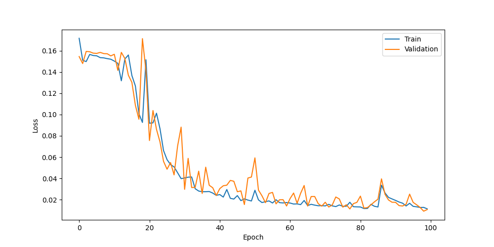
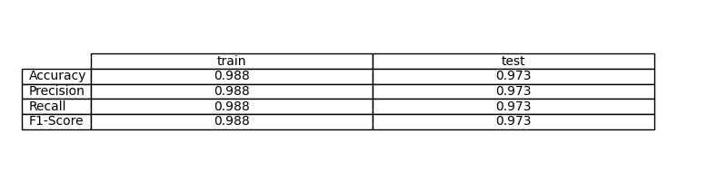
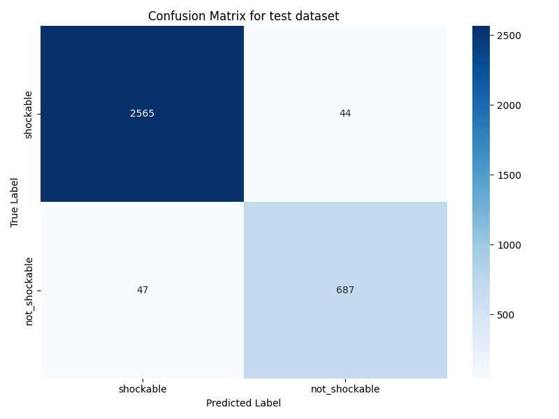

# Ejercicio 7: Clasificación de ECG con LSTM

En este ejercicio hemos trabajado con señales de ECG para clasificarlas en dos categorías: shockable y not_shockable. El objetivo principal ha sido implementar y entrenar una red neuronal basada en LSTM, adaptando el flujo de trabajo de ejercicios anteriores pero centrándonos únicamente en este tipo de modelo recurrente, que es especialmente adecuado para secuencias temporales como las señales cardíacas.

## Preparación y preprocesado

Comenzamos cargando el dataset de ECG, que ya habíamos utilizado en ejercicios previos. El preprocesado ha consistido en normalizar las señales usando únicamente los datos de entrenamiento, asegurando así que la información del test no contamine el proceso de aprendizaje. La normalización se ha guardado para poder aplicarla también en la fase de evaluación. El dataset se ha dividido en entrenamiento, validación y test, manteniendo la coherencia con la metodología de los ejercicios anteriores.

## Arquitectura y entrenamiento del modelo

Para este ejercicio hemos optado por una arquitectura LSTM sencilla, con dos capas y un tamaño de estado oculto de 16. La entrada al modelo es la señal de ECG normalizada, que se adapta a la forma esperada por la LSTM (batch, secuencia, 1). El entrenamiento se ha realizado durante 100 épocas, utilizando Adam como optimizador y MSE como función de pérdida, igual que en los modelos anteriores para mantener la comparabilidad. El modelo se ha entrenado en GPU si estaba disponible, acelerando así el proceso.

Durante el entrenamiento, se ha monitorizado la pérdida tanto en entrenamiento como en validación. En la siguiente imagen se puede observar la evolución de ambas curvas, donde se aprecia cómo el modelo va mejorando y ajustándose a los datos:

La gráfica muestra una disminución progresiva de la pérdida, aunque en algunas ocasiones se observan pequeñas oscilaciones, típicas en este tipo de modelos y conjuntos de datos.

## Evaluación y resultados

Una vez finalizado el entrenamiento, se ha evaluado el modelo tanto en el conjunto de entrenamiento como en el de test. Para ello, se han calculado métricas como la accuracy, precisión, recall y F1-score, que permiten valorar el rendimiento global del modelo. Los resultados obtenidos se resumen en la siguiente imagen:

El modelo logra una precisión razonable. Sin embargo, el F1-score y recall varían según la distribución de clases, lo cual es común en clasificación binaria desbalanceada.

Además, se ha generado la matriz de confusión para analizar en detalle los aciertos y errores del modelo. A continuación se muestra la matriz correspondiente al conjunto de test:

En la matriz se puede ver que el modelo tiende a acertar más en una de las clases, lo que sugiere que podría beneficiarse de técnicas adicionales como el balanceo de clases o el ajuste de hiperparámetros. Aun así, el rendimiento es satisfactorio para una primera aproximación con LSTM.

## Conclusiones
El uso de LSTM para la clasificación de señales de ECG ha resultado efectivo, permitiendo capturar la información temporal de las señales. El proceso ha seguido la misma estructura que en ejercicios anteriores, pero adaptando la arquitectura y el preprocesado a las necesidades de las redes recurrentes. El flujo de trabajo ha consistido en una serie de ensayos de prueba y error, a modo heurístico, lo que ha facilitado la exploración de diferentes configuraciones. El análisis de las métricas y las gráficas generadas nos ha permitido entender mejor el comportamiento del modelo y sus posibles mejoras futuras.